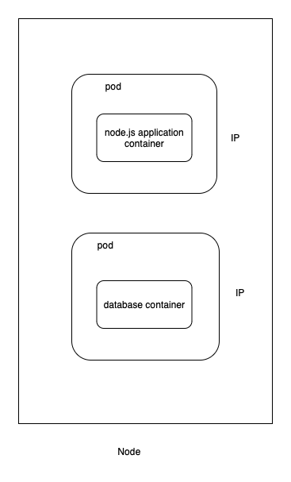
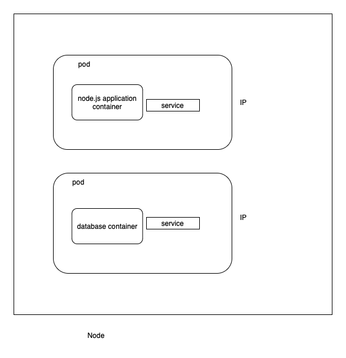
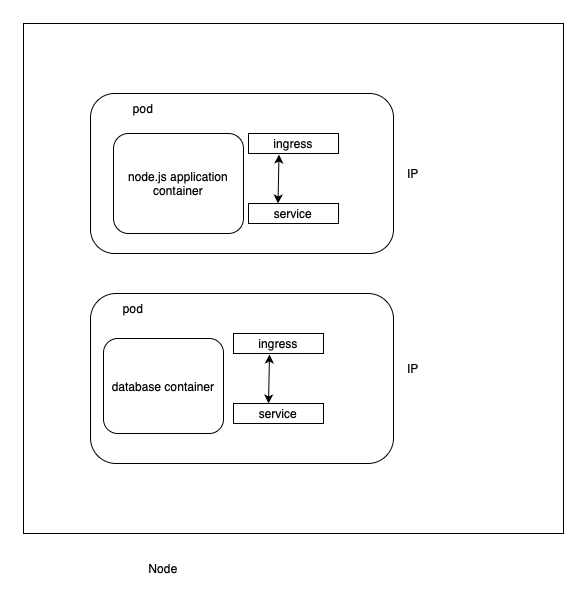

# Hibo : Habit Manager (CRUD app using express and typescript) 🚀

A brief description of what your project does and why it is useful.

## Table of Contents 📋

- [What is Kubernetes](#whatiskubernetes)
- [What problems kubernetes solve?](#whatproblemskubernetessolve)
- [What are the tasks of an orchestration tool?](#whatarethetasksofanorchestrationtool)
- [Kubernetes Components](#kubernetescomponents)
- [Installation](#kubernetescomponents)
- [Usage](#usage)
- [Features](#features)
- [Contributing](#contributing)
- [License](#license)
- [Contact](#contact)
- [Acknowledgements](#acknowledgements)

## What is Kubernetes 💻
- Open source
- Container orchestration tool
- Helps to manage containerized applications in different deployment environments

## What problems kubernetes solve? 💻
- The need of orchestration tool
- Trend from monolithic to microservices

## What are the tasks of an orchestration tool?💻
- High availability or no downtime
- Scalability or high performance
- Diasaster revovery - backup and restore

## Kubernetes Components
- Pod
    - Smallest unit of k8s
    - abstraction over container
    - layer on container
    - usually 1 application per pod
    - each pod gets its owb IP address
    - New IP address on re-creation

- Service
    - static IP address or permanent IP address
    - Lifecycle of POD and service is not connected
    - Types of service
        - External Service - opens communication from external sources
        - Internal Service - database not suppose to open to external resources
  
- Ingress
    - Manages external access to services within k8s cluster
    - ways to expose services to external world
    - offers feature like load balancing, SSL termination, name-based hosting
 

- Volumes
- Secrets
- ConfigMap
- StatefulSet
- Deployments

## Installation

## Usage

## Features ✨

## Contributing 🤝

## Contact 📧

[Manisha Jadhav](https://github.com/m.s.jadhav03)
